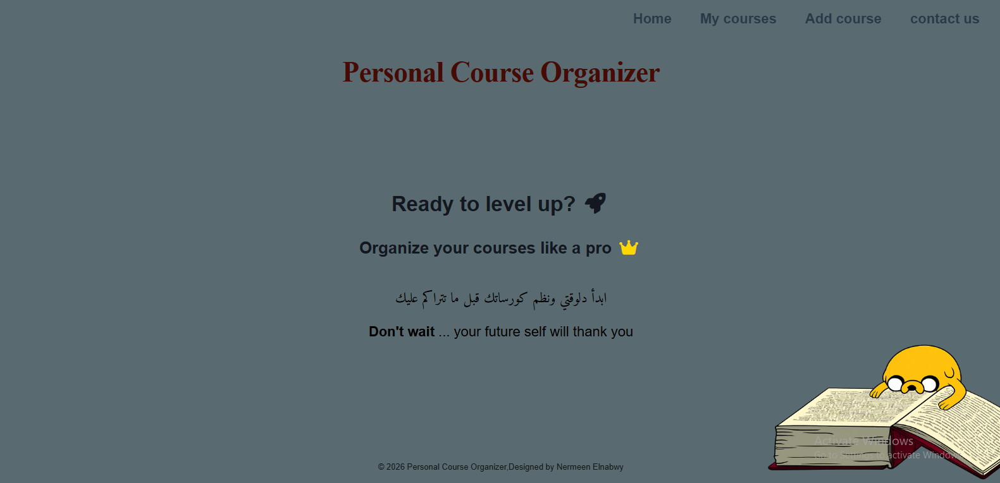
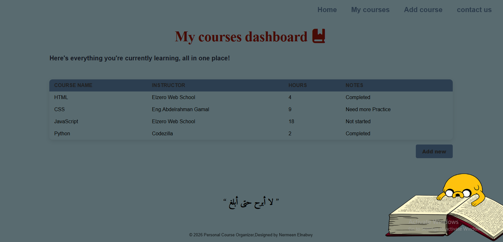
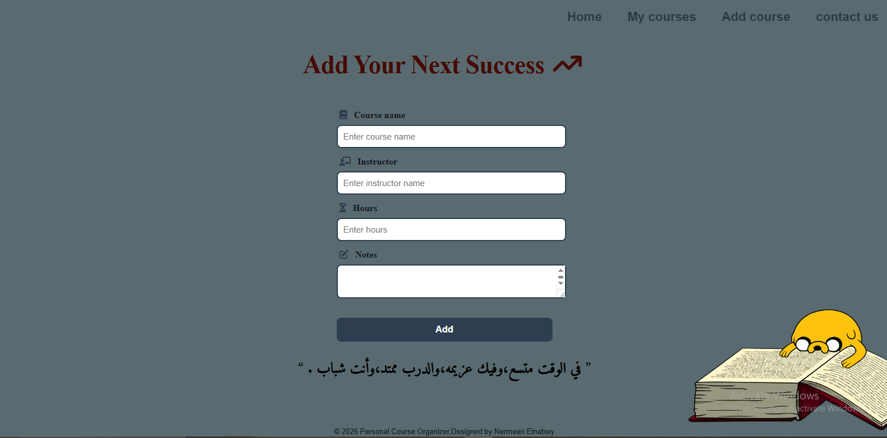
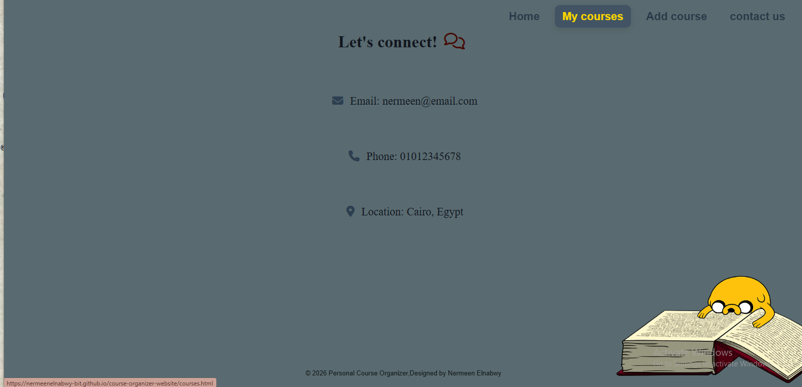

# Course Organizer Website

## Overview

Course Organizer Website is a responsive front-end web application developed using HTML and CSS. The project provides a clean and organized interface for browsing educational courses and related information through a simple and user-friendly design.

This project was developed as part of a university coursework to practice front-end web development fundamentals and responsive web design.

---

## Features

- Responsive design for different screen sizes
- Clean and modern user interface
- Organized course sections
- Navigation bar for easy browsing
- Course cards with structured layout
- Informative About section
- Contact section
- User-friendly design

---

## Technologies Used

- HTML5
- CSS3

---

## Screenshots

### home Section

### Courses Section

### add Section

### contact Section

---

## Live Demo

https://nermeenelnabwy-bit.github.io/course-organizer-website/

---

## Learning Outcomes

Through this project, I improved my skills in:

- HTML page structure
- CSS styling
- Responsive web design
- Website layout organization
- Building clean and user-friendly interfaces

---

## Author

**Nermeen Elnabwy**

Computer Science & Artificial Intelligence Student

GitHub:
https://github.com/nermeenelnabwy-bit

